# Домашнее задание к занятию «Хранение в K8s. Часть 1» - Илларионов Дмитрий

### Цель задания

В тестовой среде Kubernetes нужно обеспечить обмен файлами между контейнерам пода и доступ к логам ноды.

------

### Чеклист готовности к домашнему заданию

1. Установленное K8s-решение (например, MicroK8S).
2. Установленный локальный kubectl.
3. Редактор YAML-файлов с подключенным GitHub-репозиторием.

------

### Дополнительные материалы для выполнения задания

1. [Инструкция по установке MicroK8S](https://microk8s.io/docs/getting-started).
2. [Описание Volumes](https://kubernetes.io/docs/concepts/storage/volumes/).
3. [Описание Multitool](https://github.com/wbitt/Network-MultiTool).

------

### Задание 1 

**Что нужно сделать**

Создать Deployment приложения, состоящего из двух контейнеров и обменивающихся данными.

1. Создать Deployment приложения, состоящего из контейнеров busybox и multitool.
2. Сделать так, чтобы busybox писал каждые пять секунд в некий файл в общей директории.
3. Обеспечить возможность чтения файла контейнером multitool.
4. Продемонстрировать, что multitool может читать файл, который периодоически обновляется.
5. Предоставить манифесты Deployment в решении, а также скриншоты или вывод команды из п. 4.

#### Решение

Подготовил и протестировал команду записи в файл каждый 5 сек:

```
while true; do echo "$(date +%T)">> timefile; sleep 5; done
```

Создал деплоймент:

```
apiVersion: apps/v1
kind: Deployment
metadata:
  name: busybox-vol
  labels:
    app: busybox-vol
spec:
  replicas: 1
  selector:
    matchLabels:
      app: busybox-vol
  template:
    metadata:
      labels:
        app: busybox-vol
    spec:
      containers:
      - name: busybox
        image: busybox
        command: ['sh', '-c', 'while true; do echo "$(date +%T)">> /output/timefile; sleep 5; done']
        volumeMounts:
        - name: vol
          mountPath: /output        
      - name: multitool
        image: wbitt/network-multitool
        env:
        - name: HTTP_PORT
          value: "8080"
        - name: HTTPS_PORT
          value: "11443"
        ports:
        - containerPort: 8080
          name: http-port
        - containerPort: 11443
          name: https-port
        volumeMounts:
        - name: vol
          mountPath: /input
      volumes:
      - name: vol
        hostPath:
          path: /var/data     
```

Применил деплоймент.

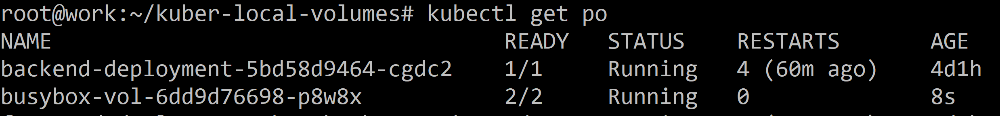

Подключаюсь к контейнеру мултитула:

```
kubectl exec -it busybox-vol-6dd9d76698-p8w8x -c multitool /bin/sh
```
Захожу в вольюм

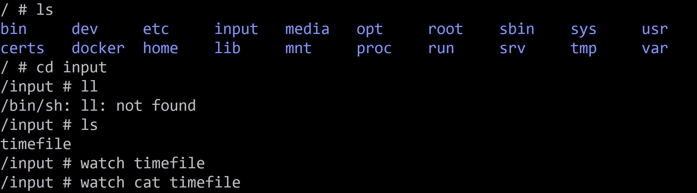

Читаю онлайн файл через watch:

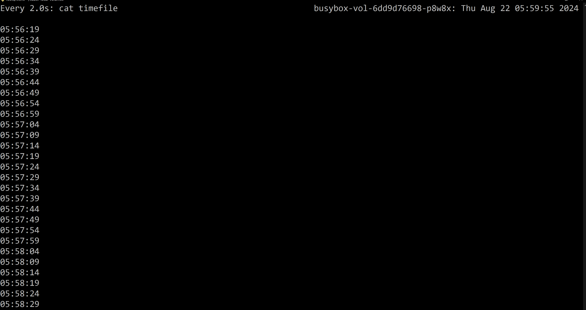

Еще подключился к серверу с кубермикро и проверил файл:

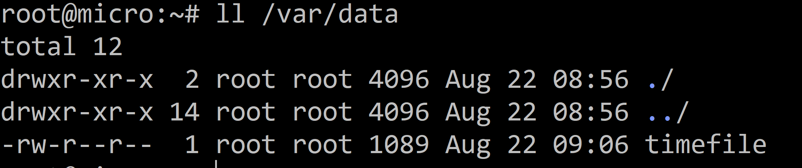

Но, в даном случае постоянный вольюм видимо излишен. Еще пробую переделать на Emtpy dir:

Правлю деплоймент:

```
apiVersion: apps/v1
kind: Deployment
metadata:
  name: busybox-vol
  labels:
    app: busybox-vol
spec:
  replicas: 1
  selector:
    matchLabels:
      app: busybox-vol
  template:
    metadata:
      labels:
        app: busybox-vol
    spec:
      containers:
      - name: busybox
        image: busybox
        command: ['sh', '-c', 'while true; do echo "$(date +%T)">> /output/timefile; sleep 5; done']
        volumeMounts:
        - name: vol
          mountPath: /output        
      - name: multitool
        image: wbitt/network-multitool
        env:
        - name: HTTP_PORT
          value: "8080"
        - name: HTTPS_PORT
          value: "11443"
        ports:
        - containerPort: 8080
          name: http-port
        - containerPort: 11443
          name: https-port
        volumeMounts:
        - name: vol
          mountPath: /input
      volumes:
      - name: vol
        emptyDir: {}
        # hostPath:
        #   path: /var/data 
```

применяю:

Опять проверил:

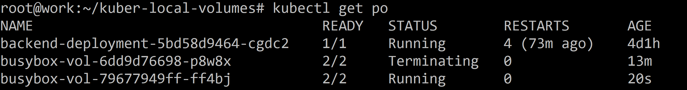

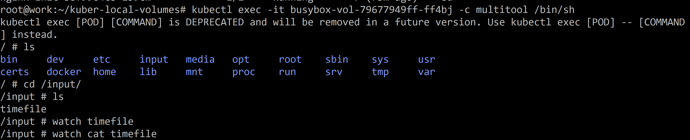

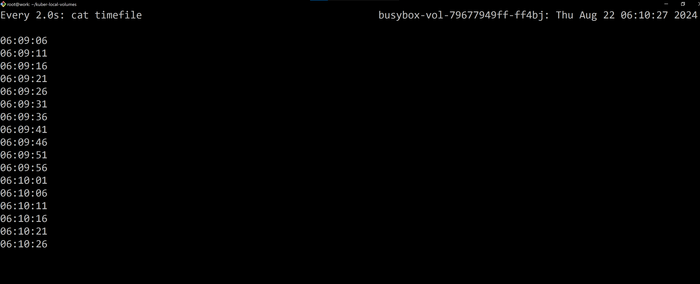

Еще на сервере с кубером удалил ранее созданный файл вольюма:
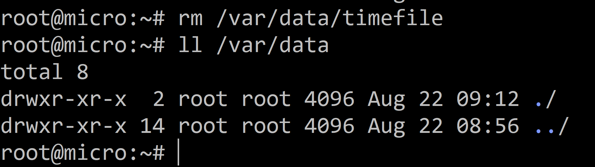

И проверил что все работает и без него:

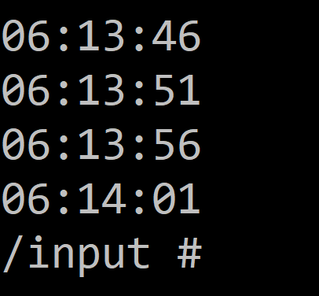

------

### Задание 2

**Что нужно сделать**

Создать DaemonSet приложения, которое может прочитать логи ноды.

1. Создать DaemonSet приложения, состоящего из multitool.
2. Обеспечить возможность чтения файла `/var/log/syslog` кластера MicroK8S.
3. Продемонстрировать возможность чтения файла изнутри пода.
4. Предоставить манифесты Deployment, а также скриншоты или вывод команды из п. 2.

#### Решение

Создал и применил даймонсет:

```
apiVersion: apps/v1
kind: DaemonSet
metadata:
  name: daemonset-mul
  labels:
    app: daemonset-mul
spec:
  selector:
    matchLabels:
      app: daemonset-mul
  template:
    metadata:
      labels:
        app: daemonset-mul
    spec:
      containers:
      - name: multitool
        image: wbitt/network-multitool
        env:
        - name: HTTP_PORT
          value: "8080"
        - name: HTTPS_PORT
          value: "11443"
        ports:
        - containerPort: 8080
          name: http-port
        - containerPort: 11443
          name: https-port
        volumeMounts:
        - name: vol
          mountPath: /input
      volumes:
      - name: vol
        hostPath:
          path: /var/log/syslog
```

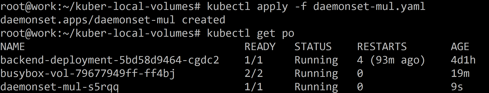

```
kubectl exec -it daemonset-mul-s5rqq /bin/sh
```
выполнил команду:

```
cat input
```
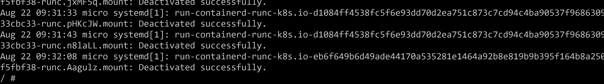

При этом примонтировался именно файла а не папка:

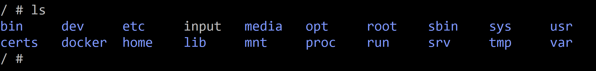


------

### Правила приёма работы

1. Домашняя работа оформляется в своём Git-репозитории в файле README.md. Выполненное задание пришлите ссылкой на .md-файл в вашем репозитории.
2. Файл README.md должен содержать скриншоты вывода необходимых команд `kubectl`, а также скриншоты результатов.
3. Репозиторий должен содержать тексты манифестов или ссылки на них в файле README.md.

------
